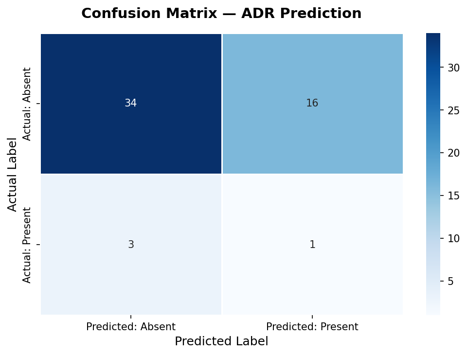
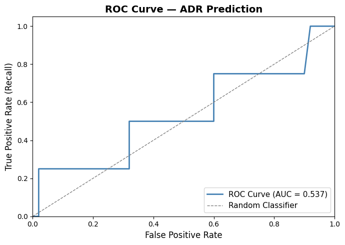
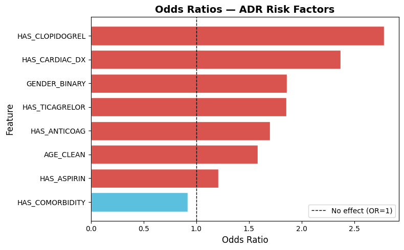

# Model 1 — ADR Prediction (Cohort A)

## Overview

Binary classification model to predict Adverse Drug Reactions (ADR) in patients prescribed antiplatelet and anticoagulant medications.

**Target Variable:** ADR Present / Absent  
**Algorithm:** Logistic Regression (`class_weight='balanced'`)  
**Dataset:** 272 patient records from a pharmacy department

---

## Features Used

| Feature | Description |
|---------|-------------|
| AGE_CLEAN | Patient age (numeric, extracted from free text) |
| GENDER_BINARY | Gender (1 = Male, 0 = Female) |
| HAS_COMORBIDITY | Presence of past medical history / comorbidities |
| HAS_ASPIRIN | Aspirin prescribed |
| HAS_CLOPIDOGREL | Clopidogrel prescribed |
| HAS_TICAGRELOR | Ticagrelor prescribed |
| HAS_ANTICOAG | Anticoagulant agent prescribed |
| HAS_CARDIAC_DX | Cardiac diagnosis (ACS, AWMI, IWMI, NSTEMI, CAD, etc.) |

---

## Results

| Metric | Value |
|--------|-------|
| Accuracy | 0.6481 |
| Precision | 0.0606 |
| Recall | 0.2500 |
| F1 Score | 0.0976 |
| AUC-ROC | 0.5375 |

### Confusion Matrix

### ROC Curve

### Odds Ratios

---

## Key Findings

- **Clopidogrel (OR: 2.79)** — strongest ADR risk factor in this cohort
- **Cardiac diagnosis (OR: 2.37)** — second strongest predictor
- **Male gender (OR: 1.86)** — associated with higher ADR risk
- **Ticagrelor (OR: 1.86)** — notable risk factor
- **Comorbidity (OR: 0.92)** — marginally protective (counterintuitive; warrants clinical discussion)

---

## Limitations

The dataset contains only 22 ADR-positive cases out of 272 records (~8%). With ~4 positive cases in the test set, classification metrics (precision, recall, F1) have limited reliability. The AUC-ROC of 0.537 indicates marginal discrimination.

**The Odds Ratio analysis is the primary clinically meaningful output from this dataset.** A minimum of 100+ ADR-positive cases is recommended for reliable binary classification in future studies.