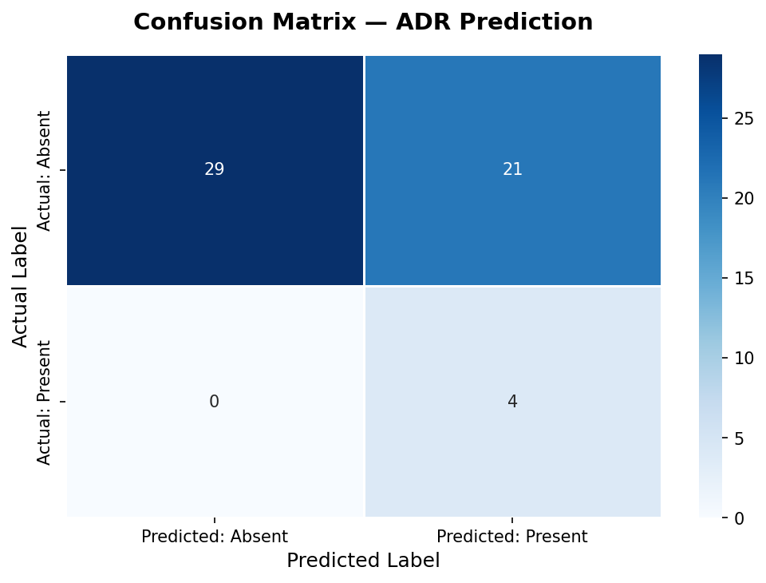
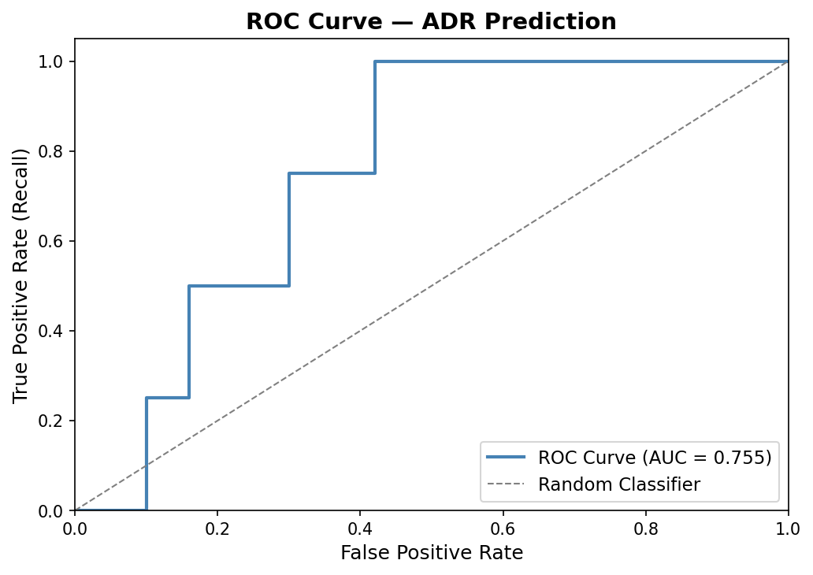
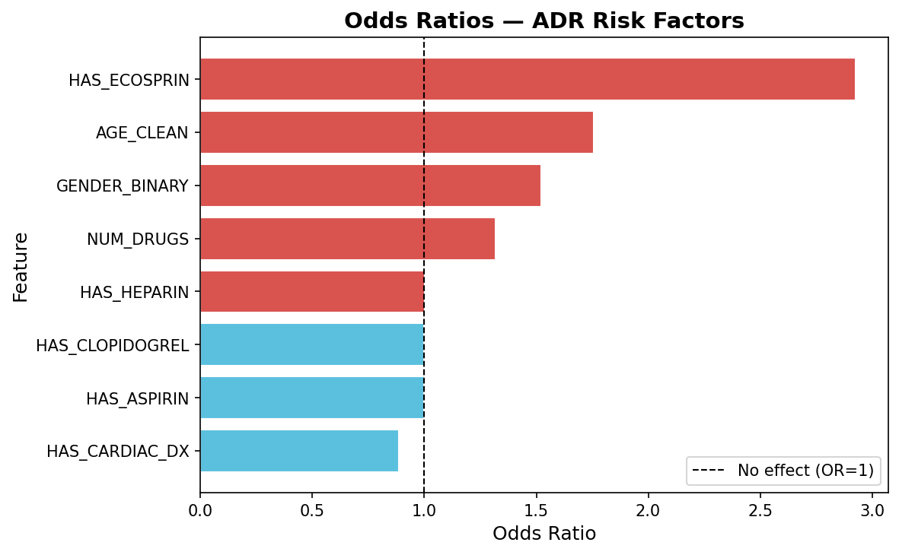

# Model 2 — ADR Prediction (Cohort B)

## Overview

Binary classification model to predict Adverse Drug Reactions (ADR) in a second independent cohort of patients prescribed antiplatelet and anticoagulant medications.

**Target Variable:** ADR Present / Absent  
**Algorithm:** Logistic Regression (`class_weight='balanced'`)  
**Dataset:** 269 patient records from a pharmacy department

---

## Features Used

| Feature | Description |
|---------|-------------|
| AGE_CLEAN | Patient age (numeric) |
| GENDER_BINARY | Gender (1 = Male, 0 = Female) |
| NUM_DRUGS | Number of drugs prescribed |
| HAS_ASPIRIN | Aspirin prescribed |
| HAS_ECOSPRIN | Ecosprin (brand-name Aspirin) prescribed |
| HAS_CLOPIDOGREL | Clopidogrel prescribed |
| HAS_HEPARIN | Heparin prescribed |
| HAS_CARDIAC_DX | Cardiac diagnosis flag |

---

## Results

| Metric | Value |
|--------|-------|
| Accuracy | 0.6111 |
| Precision | 0.1600 |
| Recall | 1.0000 |
| F1 Score | 0.2759 |
| AUC-ROC | 0.7550 |

### Confusion Matrix

### ROC Curve

### Odds Ratios

---

## Key Findings

- **Recall of 1.0** — model successfully identified all ADR-positive cases in the test set. No missed ADRs (zero false negatives), which is the most clinically important outcome
- **Ecosprin (OR: 2.95)** — strongest ADR risk factor in this cohort
- **Age (OR: 1.77)** — older patients at significantly higher risk
- **Male gender (OR: 1.55)** — consistent with Cohort A findings
- **Number of drugs (OR: 1.30)** — polypharmacy associated with higher ADR risk, clinically expected
- **AUC-ROC: 0.755** — substantially better discrimination than Cohort A, indicating this dataset's features are more predictive

---

## Comparison with Model 1

| Metric | Model 1 (Cohort A) | Model 2 (Cohort B) |
|--------|-------------------|-------------------|
| AUC-ROC | 0.537 | **0.755** |
| Recall | 0.25 | **1.00** |
| F1 Score | 0.098 | **0.276** |

Model 2 performs significantly better, likely due to additional structured features (weight, number of drugs, Ecosprin flag) and a slightly different patient cohort profile.

---

## Limitations

Class imbalance remains present in this dataset. High recall (1.0) comes at the cost of precision (0.16), meaning the model raises false alarms on some ADR-absent patients. In a clinical screening context, this trade-off is acceptable — a false alarm is far less harmful than a missed ADR.