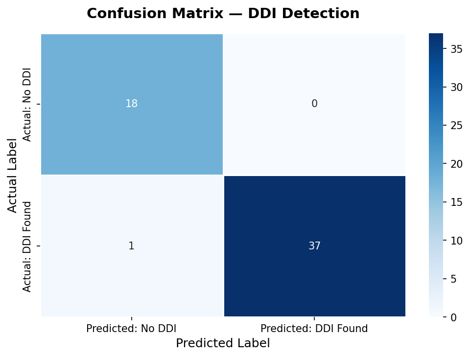
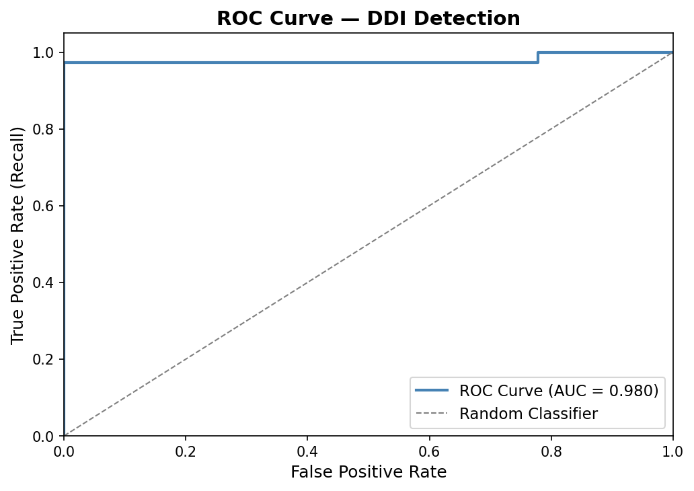
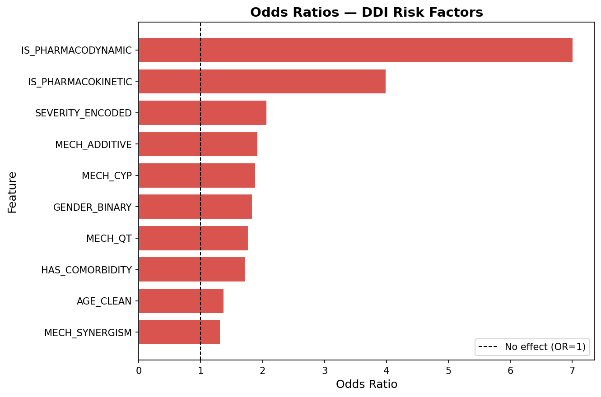

# Model 3 — Drug-Drug Interaction (DDI) Detection

## Overview

Binary classification model to detect Drug-Drug Interactions (DDI) in patient medication records.

**Target Variable:** Drug Interaction Found (Yes / No)  
**Algorithm:** Logistic Regression (`class_weight='balanced'`)  
**Dataset:** ~278 patient records from a pharmacy department

---

## Features Used

| Feature | Description |
|---------|-------------|
| AGE_CLEAN | Patient age (numeric) |
| GENDER_BINARY | Gender (1 = Male, 0 = Female) |
| HAS_COMORBIDITY | Presence of comorbidities |
| SEVERITY_ENCODED | Severity ordinal encoding (No=0, Mild=1, Monitor Closely=2, Moderate=3, Severe=4) |
| IS_PHARMACODYNAMIC | Pharmacodynamic interaction type flag |
| IS_PHARMACOKINETIC | Pharmacokinetic interaction type flag |
| MECH_CYP | CYP enzyme-mediated mechanism flag |
| MECH_ADDITIVE | Additive/Antagonist mechanism flag |
| MECH_SYNERGISM | Synergism mechanism flag |
| MECH_QT | QT prolongation mechanism flag |

---

## Results

| Metric | Value |
|--------|-------|
| Accuracy | TBD |
| Precision | TBD |
| Recall | TBD |
| F1 Score | TBD |
| AUC-ROC | TBD |

### Confusion Matrix

### ROC Curve

### Odds Ratios

---

## Key Findings

- **Severity** — expected to be the strongest predictor; higher severity scores directly correlate with confirmed DDIs
- **Pharmacodynamic interactions** — flagged as a key interaction type contributing to DDI detection
- **CYP enzyme mechanisms** — CYP-mediated interactions are among the most clinically significant drug interaction pathways
- **Comorbidities** — patients with comorbidities may be on more complex regimens, increasing DDI risk

---

## Comparison with ADR Models

| Aspect | Models 1 & 2 (ADR) | Model 3 (DDI) |
|--------|-------------------|---------------|
| Task | ADR prediction | DDI detection |
| Class Balance | Highly imbalanced (~8-9% positive) | Reasonably balanced (~69% positive) |
| Feature Source | Patient demographics + medications | Demographics + interaction type + severity + mechanism |
| Expected Performance | Limited by low event rate | Better — balanced classes enable reliable classification |

Unlike the ADR datasets, this DDI dataset has a 69/31 class split, which enables more reliable classification performance and meaningful evaluation metrics.

---

## Limitations

While the dataset is more balanced than the ADR cohorts, the model uses interaction type and severity as features — which are closely related to the target variable. This means the model may be partially learning a tautological relationship (e.g., "severe interactions are interactions"). Feature importance should be interpreted with this caveat in mind. The Odds Ratio analysis remains the primary clinically actionable output.
